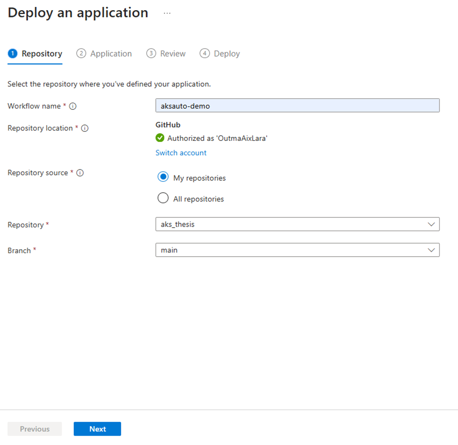
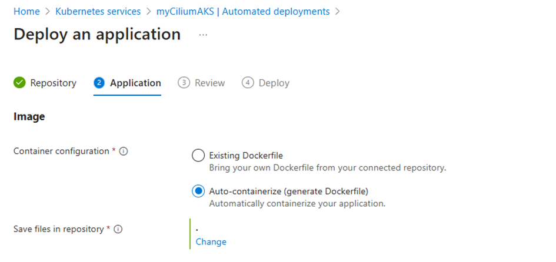
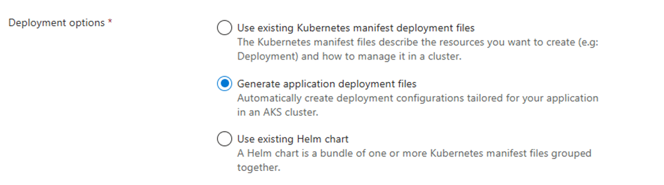
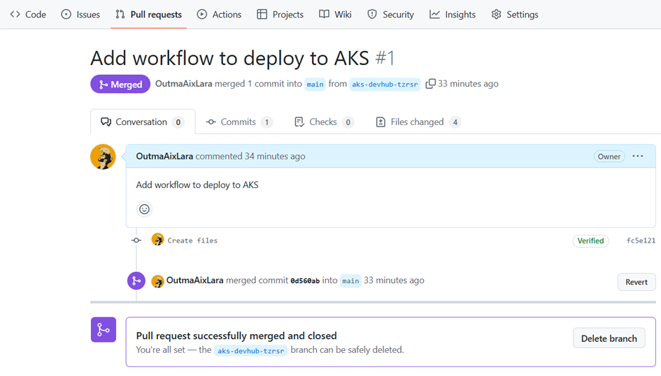
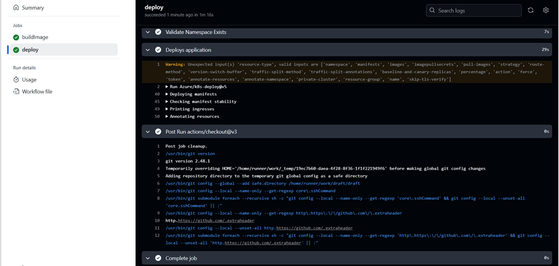
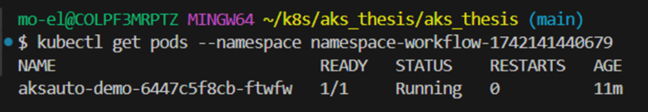

# Automated Deployments

In this example, we configure an automated deployment for our application helloaachen:

Next, we select the options to auto-containerize the application and generate the Kubernetes manifests:

This process triggers a pull request on our GitHub repository via GitHub Actions. The pull request includes the new Kubernetes manifests.

After reviewing the changes, we merged the pull request to trigger the deployment:

Once the pull request is merged, the automated deployment process begins. 
We verify the deployment by checking the jobs, ensuring that the application has been correctly deployed:

Finally, we confirm that the application is running on AKS by inspecting the cluster's pods:

For more details, please refer to [Automated deployments for Azure Kubernetes Service](https://learn.microsoft.com/en-us/azure/aks/automated-deployments). 