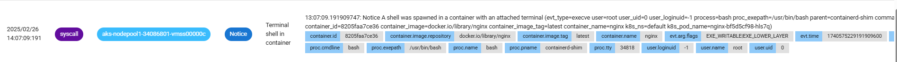
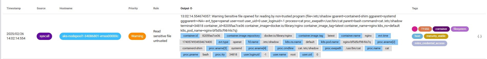

## Install Falco
helm repo add falcosecurity https://falcosecurity.github.io/charts
helm repo update

helm install --replace falco --namespace falco --create-namespace --set tty=true falcosecurity/falco

## Test
kubectl create deployment nginx --image=nginx

kubectl exec -it $(kubectl get pods --selector=app=nginx -o name) -- bash
root@nginx-bf5d5cf98-hls7q:/# su root
root@nginx-bf5d5cf98-hls7q:/# cat /etc/shadow

## Verify the triggered rule
kubectl logs -l app.kubernetes.io/name=falco -n falco -c falco | grep Notice
kubectl logs -l app.kubernetes.io/name=falco -n falco -c falco | grep Warning

## Install Falcosidekick and Falcosidekick-UI
helm upgrade --namespace falco falco falcosecurity/falco --set falcosidekick.enabled=true --set falcosidekick.webui.enabled=true

## Display events in the UI
kubectl -n falco port-forward svc/falco-falcosidekick-ui 2802

## Test
kubectl create deployment nginx --image=nginx

kubectl exec -it $(kubectl get pods --selector=app=nginx -o name) -- bash
root@nginx-bf5d5cf98-hls7q:/# su root
root@nginx-bf5d5cf98-hls7q:/# cat /etc/shadow

mo-el@COLPF3MRPTZ MINGW64 ~
$ kubectl logs -l app.kubernetes.io/name=falco -n falco | grep Notice
Defaulted container "falco" out of: falco, falcoctl-artifact-follow, falco-driver-loader (init), falcoctl-artifact-install (init)
Defaulted container "falco" out of: falco, falcoctl-artifact-follow, falco-driver-loader (init), falcoctl-artifact-install (init)
12:35:08.309100801: Notice A shell was spawned in a container with an attached terminal (evt_type=execve user=root user_uid=0 user_loginuid=-1 process=bash proc_exepath=/usr/bin/bash parent=containerd-shim command=bash terminal=34816 exe_flags=EXE_WRITABLE|EXE_LOWER_LAYER container_id=8205faa7ce36 container_image=docker.io/library/nginx container_image_tag=latest container_name=nginx k8s_ns=default k8s_pod_name=nginx-bf5d5cf98-hls7q)

mo-el@COLPF3MRPTZ MINGW64 ~
$ kubectl logs -l app.kubernetes.io/name=falco -n falco | grep Warning
Defaulted container "falco" out of: falco, falcoctl-artifact-follow, falco-driver-loader (init), falcoctl-artifact-install (init)
Defaulted container "falco" out of: falco, falcoctl-artifact-follow, falco-driver-loader (init), falcoctl-artifact-install (init)
12:36:10.343715311: Warning Sensitive file opened for reading by non-trusted program (file=/etc/shadow gparent=su ggparent=bash gggparent=containerd-shim evt_type=openat user=root user_uid=0 user_loginuid=-1 process=cat proc_exepath=/usr/bin/cat parent=bash command=cat /etc/shadow terminal=34816 container_id=8205faa7ce36 container_image=docker.io/library/nginx container_image_tag=latest container_name=nginx k8s_ns=default k8s_pod_name=nginx-bf5d5cf98-hls7q)

https://falco.org/docs/getting-started/falco-kubernetes-quickstart/