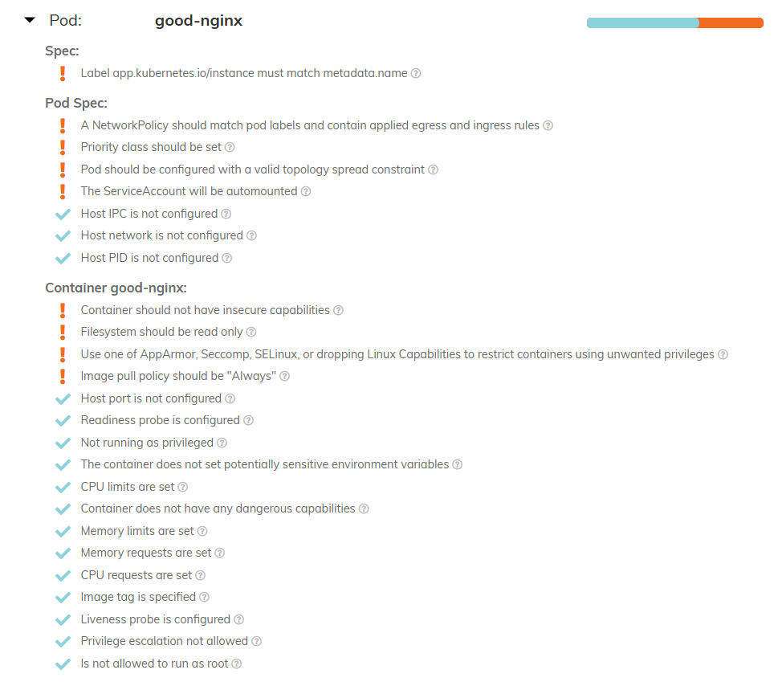

helm repo add fairwinds-stable https://charts.fairwinds.com/stable
helm upgrade --install polaris fairwinds-stable/polaris --namespace demo --create-namespace
kubectl port-forward --namespace demo svc/polaris-dashboard 8080:80

