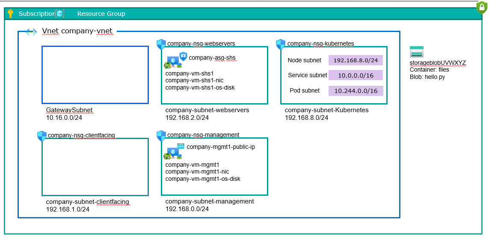

# Kubernetes Best Practices for AKS  
This repository demonstrates some best practices for deploying and securing Azure Kubernetes Service (AKS) clusters. It includes hands-on validation of tools like **Falco**, **KubeArmor**, **KEDA** and performance benchmarking of ingress controllers.

## Features
- AKS cluster hardening with Azure Policy and CIS benchmarks.
- Runtime security testing with Falco and KubeArmor.
- Dynamic scaling using KEDA (tested with MSSQL).
- Ingress controller performance analysis (Istio, Traefik, Cilium, Azure App Routing).

## Quick Start
1. **Prerequisites**:
   - Azure CLI (`az`)
   - Kubernetes CLI (`kubectl`)
   - Helm

2. **AKS Cluster Provisioning**:

   Please refer to `SmallEnv\SmallVMEnvironment.md` to spin up the AKS cluster.

3. **Ingress Benchmarking**:

   Ingress benchmarking scripts and results are under `3-networking\ingress-benchmark`
# Small Infrastructure environment

This environment builds a VNet with subnets to create a segmented simplified environment that simulate the company environment . It sets up one of the NSGs to allow SSH from company Linköping office network (or with VPN to Linköping). This means that VM(s) created in the Management subnet can be reached with SSH directly over internet.

The environment have two VMs, one in the Management subnet, and one in the WebServers subnet.

## Parameters

    subscription=<Subscription>
    resourcegroup="K8S-Test-Small-Env"
    location="swedencentral"

    companyvnet="company-vnet"
    companysubnetmanagement="company-subnet-management"
    companysubnetwebservers="company-subnet-webservers"
    companysubnetclientfacing="company-subnet-clientfacing"
    companysubnetkubernetes="company-subnet-kubernetes"
    companygatewaysubnet="GatewaySubnet"
    companysubnetmanagementcidr="192.168.0.0/24"
    companysubnetclientfacingcidr="192.168.1.0/24"
    companysubnetwebserverscidr="192.168.2.0/24"
    companysubnetkubernetescidr="192.168.8.0/24"
    companygatewaysubnetcidr="10.16.0.0/24"
    companynsgmanagement="company-nsg-management"
    companynsgwebservers="company-nsg-webservers"
    companynsgclientfacing="company-nsg-clientfacing"
    companynsgkubernetes="company-nsg-kubernetes"
    companyasgshs="company-asg-shs"

    companyvmmgmt1="company-vm-mgmt1"
    companynicmgmt1="company-vm-mgmt1-nic"
    companyosdiskmgmt1="company-vm-mgmt1-os-disk"
    companypipmgmt1="company-vm-mgmt1-public-ip"

    companyvmshs1="company-vm-shs1"
    companynicshs1="company-vm-shs1-nic"
    companyosdiskshs1="company-vm-shs1-os-disk"

    aks="myaks"
    acr="acrthesis"

## Create Resource Group

    az group create --subscription $subscription --name $resourcegroup --location $location

## Create NSGs, virtual network and subnets

    az network asg create --location $location --subscription $subscription --resource-group $resourcegroup --name $companyasgshs

    az network nsg create --location $location --subscription $subscription --resource-group $resourcegroup --name $companynsgmanagement
    
    az network nsg rule create --subscription $subscription --resource-group $resourcegroup --nsg-name $companynsgmanagement --name "SSHFromcompany" --priority 200 --access Allow --direction Inbound --protocol tcp --source-address-prefixes 88.131.68.200 88.131.68.201 88.131.68.202 --source-port-ranges * --destination-address-prefixes * --destination-port-ranges 22

    az network nsg create --location $location --subscription $subscription --resource-group $resourcegroup --name $companynsgwebservers
    
    az network nsg create --location $location --subscription $subscription --resource-group $resourcegroup --name $companynsgclientfacing

    az network nsg create --location $location --subscription $subscription --resource-group $resourcegroup --name $companynsgkubernetes

    az network vnet create --location $location --subscription $subscription --resource-group $resourcegroup --name $companyvnet --address-prefixes $companysubnetmanagementcidr $companygatewaysubnetcidr $companysubnetwebserverscidr $companysubnetclientfacingcidr $companysubnetkubernetescidr

    az network vnet subnet create --subscription $subscription --resource-group $resourcegroup --vnet-name $companyvnet --name $companysubnetmanagement --address-prefixes $companysubnetmanagementcidr --network-security-group $companynsgmanagement

    az network vnet subnet create --subscription $subscription --resource-group $resourcegroup --vnet-name $companyvnet --name $companygatewaysubnet --address-prefixes $companygatewaysubnetcidr

    az network vnet subnet create --subscription $subscription --resource-group $resourcegroup --vnet-name $companyvnet --name $companysubnetwebservers --address-prefixes $companysubnetwebserverscidr --network-security-group $companynsgwebservers

    az network vnet subnet create --subscription $subscription --resource-group $resourcegroup --vnet-name $companyvnet --name $companysubnetclientfacing --address-prefixes $companysubnetclientfacingcidr --network-security-group $companynsgclientfacing

    az network vnet subnet create --subscription $subscription --resource-group $resourcegroup --vnet-name $companyvnet --name $companysubnetkubernetes --address-prefixes $companysubnetkubernetescidr --network-security-group $companynsgkubernetes

## Create VMs

    # Create VM in Mgmt subnet with public IP. This allows SSH from company network according to NSG above
    az network public-ip create --subscription $subscription --location $location --resource-group $resourcegroup --name $companypipmgmt1 --allocation-method Static
    az network nic create --subscription $subscription --location $location --resource-group $resourcegroup --vnet $companyvnet --subnet $companysubnetmanagement --name $companynicmgmt1 --public-ip-address $companypipmgmt1
    az vm create --subscription $subscription --location $location --resource-group $resourcegroup --name $companyvmmgmt1 --nics $companynicmgmt1 --image Canonical:0001-com-ubuntu-server-focal-daily:20_04-daily-lts-gen2:Latest --os-disk-name $companyosdiskmgmt1 --os-disk-size-gb 30 --size Standard_B1s --authentication-type password --admin-username ubuntu --admin-password Password123!?

    # Create VM in Web Server subnet.
    az network nic create --subscription $subscription --location $location --resource-group $resourcegroup --vnet $companyvnet --subnet $companysubnetwebservers --name $companynicshs1 --application-security-groups $companyasgshs
    az vm create --subscription $subscription --location $location --resource-group $resourcegroup --name $companyvmshs1 --nics $companynicshs1 --image Canonical:0001-com-ubuntu-server-focal-daily:20_04-daily-lts-gen2:Latest --os-disk-name $companyosdiskshs1 --os-disk-size-gb 30 --size Standard_B1s --authentication-type password --admin-username ubuntu --admin-password Password123!?

## Create the AKS cluster (CNI Overlay)
    az aks create --resource-group $resourcegroup --name $aks --node-count 2 --enable-aad --enable-azure-rbac --vnet-subnet-id /subscriptions/$subscriptionID/resourceGroups/$resourceGroup/providers/Microsoft.Network/virtualNetworks/$companyvnet/subnets/$companysubnetkubernetes--generate-ssh-keys 

## Create the AKS cluster (Cilium)
    az aks create -n myCiliumAKS -g $resourcegroup -l --node-count 2 --network-plugin azure --network-dataplane cilium --network-plugin-mode overlay --enable-aad --enable-azure-rbac --vnet-subnet-id /subscriptions/622693e3-522a-4968-af8b-d88f7a78a66a/resourceGroups/K8S-Test-Small-Env/providers/Microsoft.Network/virtualNetworks/company-vnet/subnets/company-subnet-kubernetes --generate-ssh-keys

## Update the AKS Cluster to use Calico for network policies
    az aks update --resource-group $resourcegroup --name $aks --network-policy calico

## Uninstall Calico 
    az aks update --resource-group $resourcegroup --name $aks --network-policy none

## Connect to the AKS cluster
    az aks get-credentials --resource-group $resourcegroup --name $aks 

## Connect to the AKS nodes
    
    # Create debugger pod
    kubectl debug node/<node hostname> -it --image=mcr.microsoft.com/cbl-mariner/busybox:2.0

    # Start kubectl session
    chroot /host

    # exit the session
    exit

    # Delete debugger pod
    kubectl delete pod node-debugger-aks-nodepool1-<xxxxxxxx>-<xxxxxxxxxx>-<xxxxx>

## Create a new Azure Container Registry

    az acr create --name $acr --resource-group $resourcegroup --sku basic

## Integrate an existing ACR with an existing AKS cluster

az aks update --name $aks --resource-group $resourcegroup --attach-acr $acr

## Enable Azure Policy Add-on
az aks enable-addons --addons azure-policy --name $aks --resource-group $resourcegroup

## Restrict access to the API Server of a range of IP addresses
--api-server-authorized-ip-ranges 88.131.68.200,88.131.68.201,88.131.68.202

## Useful commands

    # Get public IP to company-vm-mgmt1 VM and SSH to it
    $companypipmgmt1ip = az network public-ip show --subscription $subscription --resource-group $resourcegroup --name $companypipmgmt1 --query "ipAddress" --output tsv
    ssh ubuntu@$companypipmgmt1ip

    # Perform web request towards company-vm-shs1, can be run from for example company-vm-mgmt1

    # Connect to a specific node
    node=$(kubectl get nodes -o jsonpath='{.items[0].metadata.name}')
    kubectl debug node/$node -it --image=busybox
    chroot /host
    

## Delete VMs etc to save cost

    # Delete VMs
    az vm delete --subscription $subscription --resource-group $resourcegroup --name $companyvmshs1 --yes
    az vm delete --subscription $subscription --resource-group $resourcegroup --name $companyvmmgmt1 --yes

    # Delete NICs, Public IPs and Disks
    az network nic delete --subscription $subscription --resource-group $resourcegroup --name $companynicshs1
    az network nic delete --subscription $subscription --resource-group $resourcegroup --name $companynicmgmt1
    az network public-ip delete --subscription $subscription --resource-group $resourcegroup --name $companypipmgmt1

    # Delete disks
    az disk delete --subscription $subscription --resource-group $resourcegroup --name $companyosdiskshs1 --yes
    az disk delete --subscription $subscription --resource-group $resourcegroup --name $companyosdiskmgmt1 --yes

