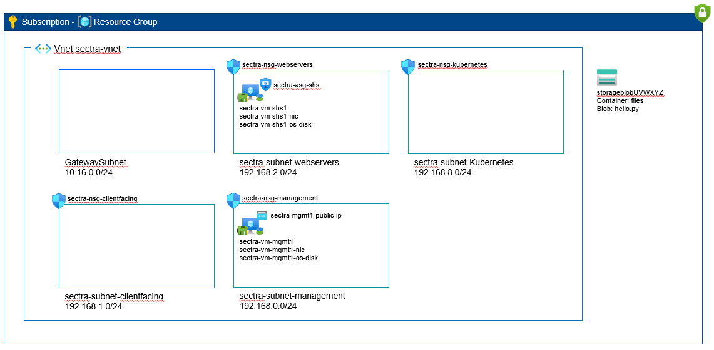

# Small Infrastructure environment

This environment builds a VNet with subnets to create a segmented environment similar to Sectra One Cloud. It sets up one of the NSGs to allow SSH from Sectra Linköping office network (or with VPN to Linköping). This means that VM(s) created in the Management subnet can be reached with SSH directly over internet.

The environment have two VMs, one in the Management subnet, and one in the WebServers subnet. The later simulates an SHS, and is installed with a simple web page that returns a web page containing the host name of the server along with the IP of the calling client as percieved by the server.

## Paramaters

    $subscription = "Sectra One Cloud Test - Kubernetes 1"
    $resourcegroup = "K8S-Test-Small-Env"
    $location = "swedencentral"

    $sectravnet = "sectra-vnet"
    $sectrasubnetmanagement = "sectra-subnet-management"
    $sectrasubnetwebservers = "sectra-subnet-webservers"
    $sectrasubnetclientfacing = "sectra-subnet-clientfacing"
    $sectrasubnetkubernetes = "sectra-subnet-kubernetes"
    $sectragatewaysubnet = "GatewaySubnet"
    $sectrasubnetmanagementcidr = "192.168.0.0/24"
    $sectrasubnetclientfacingcidr = "192.168.1.0/24"
    $sectrasubnetwebserverscidr = "192.168.2.0/24"
    $sectrasubnetkubernetescidr = "192.168.8.0/24"
    $sectragatewaysubnetcidr = "10.16.0.0/24"
    $sectransgmanagement = "sectra-nsg-management"
    $sectransgwebservers = "sectra-nsg-webservers"
    $sectransgclientfacing = "sectra-nsg-clientfacing"
    $sectransgkubernetes = "sectra-nsg-kubernetes"
    $sectraasgshs = "sectra-asg-shs"

    $sectravmmgmt1 = "sectra-vm-mgmt1"
    $sectranicmgmt1 = "sectra-vm-mgmt1-nic"
    $sectraosdiskmgmt1 = "sectra-vm-mgmt1-os-disk"
    $sectrapipmgmt1 = "sectra-vm-mgmt1-public-ip"

    $sectravmshs1 = "sectra-vm-shs1"
    $sectranicshs1 = "sectra-vm-shs1-nic"
    $sectraosdiskshs1 = "sectra-vm-shs1-os-disk"

    $aks = "myaks"

## Create Resource Group

    az group create --subscription $subscription --name $resourcegroup --location $location

## Create NSGs, virtual network and subnets

    az network asg create --location $location --subscription $subscription --resource-group $resourcegroup --name $sectraasgshs

    az network nsg create --location $location --subscription $subscription --resource-group $resourcegroup --name $sectransgmanagement
    
    az network nsg rule create --subscription $subscription --resource-group $resourcegroup --nsg-name $sectransgmanagement --name "SSHFromSectra" --priority 200 --access Allow --direction Inbound --protocol tcp --source-address-prefixes 88.131.68.200 88.131.68.201 88.131.68.202 --source-port-ranges * --destination-address-prefixes * --destination-port-ranges 22

    az network nsg create --location $location --subscription $subscription --resource-group $resourcegroup --name $sectransgwebservers
    
    az network nsg create --location $location --subscription $subscription --resource-group $resourcegroup --name $sectransgclientfacing

    az network nsg create --location $location --subscription $subscription --resource-group $resourcegroup --name $sectransgkubernetes

    az network vnet create --location $location --subscription $subscription --resource-group $resourcegroup --name $sectravnet --address-prefixes $sectrasubnetmanagementcidr $sectragatewaysubnetcidr $sectrasubnetwebserverscidr $sectrasubnetclientfacingcidr $sectrasubnetkubernetescidr

    az network vnet subnet create --subscription $subscription --resource-group $resourcegroup --vnet-name $sectravnet --name $sectrasubnetmanagement --address-prefixes $sectrasubnetmanagementcidr --network-security-group $sectransgmanagement

    az network vnet subnet create --subscription $subscription --resource-group $resourcegroup --vnet-name $sectravnet --name $sectragatewaysubnet --address-prefixes $sectragatewaysubnetcidr

    az network vnet subnet create --subscription $subscription --resource-group $resourcegroup --vnet-name $sectravnet --name $sectrasubnetwebservers --address-prefixes $sectrasubnetwebserverscidr --network-security-group $sectransgwebservers

    az network vnet subnet create --subscription $subscription --resource-group $resourcegroup --vnet-name $sectravnet --name $sectrasubnetclientfacing --address-prefixes $sectrasubnetclientfacingcidr --network-security-group $sectransgclientfacing

    az network vnet subnet create --subscription $subscription --resource-group $resourcegroup --vnet-name $sectravnet --name $sectrasubnetkubernetes --address-prefixes $sectrasubnetkubernetescidr --network-security-group $sectransgkubernetes

## Create VMs

    # Create VM in Mgmt subnet with public IP. This allows SSH from Sectra network according to NSG above
    az network public-ip create --subscription $subscription --location $location --resource-group $resourcegroup --name $sectrapipmgmt1 --allocation-method Static
    az network nic create --subscription $subscription --location $location --resource-group $resourcegroup --vnet $sectravnet --subnet $sectrasubnetmanagement --name $sectranicmgmt1 --public-ip-address $sectrapipmgmt1
    az vm create --subscription $subscription --location $location --resource-group $resourcegroup --name $sectravmmgmt1 --nics $sectranicmgmt1 --image Canonical:0001-com-ubuntu-server-focal-daily:20_04-daily-lts-gen2:Latest --os-disk-name $sectraosdiskmgmt1 --os-disk-size-gb 30 --size Standard_B1s --authentication-type password --admin-username ubuntu --admin-password Password123!?

    # Create VM in Web Server subnet.
    az network nic create --subscription $subscription --location $location --resource-group $resourcegroup --vnet $sectravnet --subnet $sectrasubnetwebservers --name $sectranicshs1 --application-security-groups $sectraasgshs
    az vm create --subscription $subscription --location $location --resource-group $resourcegroup --name $sectravmshs1 --nics $sectranicshs1 --image Canonical:0001-com-ubuntu-server-focal-daily:20_04-daily-lts-gen2:Latest --os-disk-name $sectraosdiskshs1 --os-disk-size-gb 30 --size Standard_B1s --authentication-type password --admin-username ubuntu --admin-password Password123!?

## Create the AKS cluster
    az aks create --resource-group $resourcegroup --name $aks --node-count 2 --generate-ssh-keys

## Useful commands

    # Get public IP to sectra-vm-mgmt1 VM and SSH to it
    $sectrapipmgmt1ip = az network public-ip show --subscription $subscription --resource-group $resourcegroup --name $sectrapipmgmt1 --query "ipAddress" --output tsv
    ssh ubuntu@$sectrapipmgmt1ip

    # Perform web request towards sectra-vm-shs1, can be run from for example sectra-vm-mgmt1
    

## Delete VMs etc to save cost

    # Delete VMs
    az vm delete --subscription $subscription --resource-group $resourcegroup --name $sectravmshs1 --yes
    az vm delete --subscription $subscription --resource-group $resourcegroup --name $sectravmmgmt1 --yes

    # Delete NICs, Public IPs and Disks
    az network nic delete --subscription $subscription --resource-group $resourcegroup --name $sectranicshs1
    az network nic delete --subscription $subscription --resource-group $resourcegroup --name $sectranicmgmt1
    az network public-ip delete --subscription $subscription --resource-group $resourcegroup --name $sectrapipmgmt1

    # Delete disks
    az disk delete --subscription $subscription --resource-group $resourcegroup --name $sectraosdiskshs1 --yes
    az disk delete --subscription $subscription --resource-group $resourcegroup --name $sectraosdiskmgmt1 --yes

